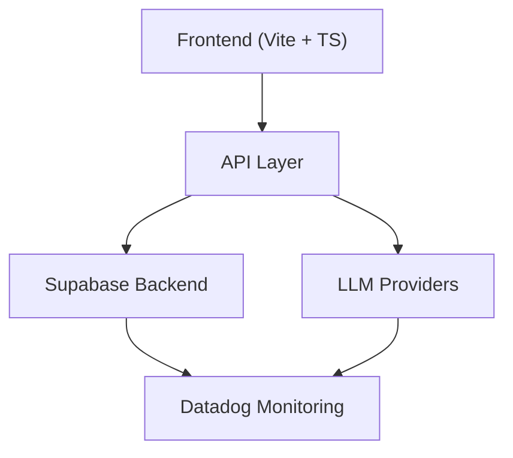

# AI Chat Application PRD - Technical Specification

## 1. Product Overview

A sophisticated AI chat interface that allows users to interact with various language models while providing detailed analytics, cost tracking, and performance monitoring.

## 2. Core Features

### Model Selection & Configuration

- Dynamic model provider selection (OpenAI, Anthropic, etc.)
- Model-specific parameter controls (temperature, max tokens, etc.)
- Custom system prompt configuration
- Model comparison interface

### Analytics Dashboard

- Real-time token usage tracking
- Cost estimation and monitoring
- Response time analytics
- Usage patterns and trends

### Technical Infrastructure

- Frontend: Vite + TypeScript
- UI Components: shadcn/ui
- Styling: Tailwind CSS
- Backend: Supabase
- Monitoring: Datadog integration

## 3. Detailed Requirements

### Chat Interface

- Markdown support with syntax highlighting
- Code block formatting
- Message threading
- Context window visualization
- Real-time token counter
- Typing indicators
- Error state handling

### Analytics Features

- Token usage breakdown by model
- Cost tracking per conversation
- Response time monitoring
- API call success/failure rates
- Custom metric tracking

### Performance Requirements

- Maximum response initiation time: 200ms
- UI updates at 60fps
- Websocket connection stability
- Offline support with message queueing

## 4. Technical Architecture



## 5. Data Schema

### Core Tables

```sql
-- Conversations
CREATE TABLE conversations (
    id UUID PRIMARY KEY,
    user_id UUID REFERENCES auth.users,
    title TEXT,
    created_at TIMESTAMP DEFAULT NOW(),
    updated_at TIMESTAMP DEFAULT NOW()
);

-- Messages
CREATE TABLE messages (
    id UUID PRIMARY KEY,
    conversation_id UUID REFERENCES conversations,
    role TEXT,
    content TEXT,
    tokens_used INTEGER,
    cost DECIMAL,
    created_at TIMESTAMP DEFAULT NOW()
);
```

## 6. Monitoring & Analytics

### Datadog Integration Points

- API latency metrics
- Token usage tracking
- Error rate monitoring
- Cost tracking alerts
- Custom user behavior metrics

## 7. Development Milestones

| Phase                     | Duration | Key Deliverables                                               |
|---------------------------|----------|----------------------------------------------------------------|
| Setup & Infrastructure    | 1 week   | Project setup, CI/CD, base architecture                        |
| Core Chat Interface       | 2 weeks  | Basic chat functionality, model integration                    |
| Analytics Dashboard       | 2 weeks  | Monitoring setup, analytics UI                                 |
| Testing & Optimization    | 1 week   | Performance testing, bug fixes                                 |

## 8. Success Metrics

- Average response time under 2 seconds
- 99.9% uptime
- Error rate below 0.1%
- User engagement (average session duration > 10 minutes)
- Cost efficiency (average cost per conversation < $0.05)

## 9. Future Considerations

- Multi-modal model support
- Custom model fine-tuning interface
- Advanced prompt engineering tools
- Team collaboration features
- API endpoint generation
